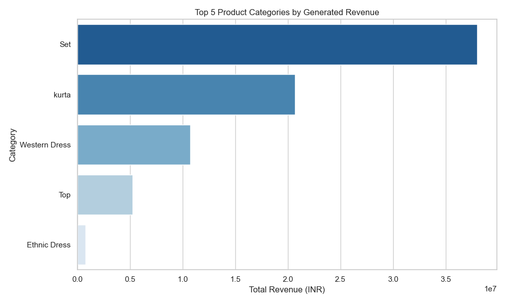
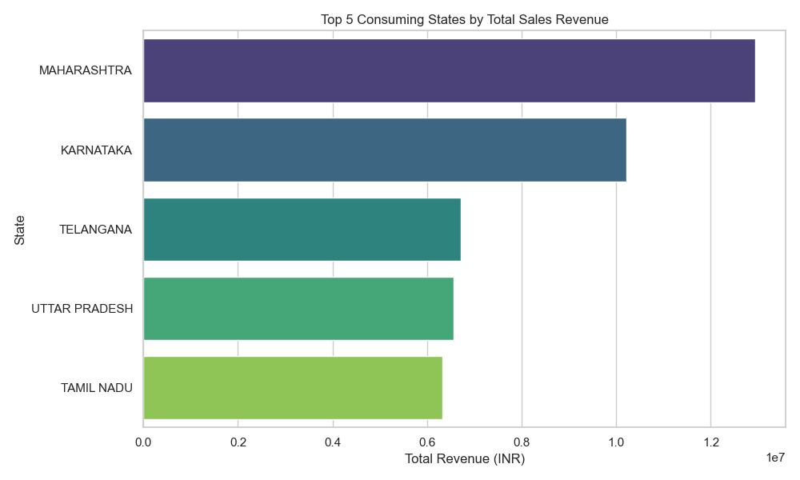
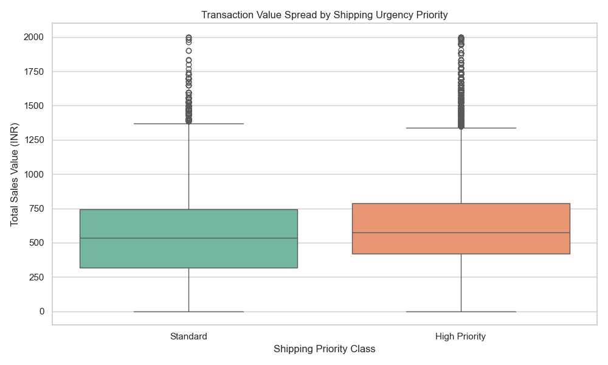

# 📊 Task 2: EDA & Business Intelligence Summary

## 📈 1. Key Operational Metrics
* **Total Cleaned Orders:** 128,968 rows
* **Average Item Price:** 646.99 INR
* **Average Order Value (AOV):** 590.30 INR

---

## 🔍 2. Core Revenue Drivers

### Top 3 Product Categories
* **Set:** 37.98M INR (49.89% share) — *Primary Revenue Driver*
* **Kurta:** 20.70M INR (27.20% share)
* **Western Dress:** 10.71M INR (14.07% share)
* *Strategic Takeaway:* Ethnic apparel lines control **over 77%** of total business revenue.

### Ecosystem Concentration
* **Platform Dominance:** Amazon.in accounted for **76.03M INR**. 
* **Off-Platform Channels:** Generated **under 100K INR** total.

---

## 🌐 3. Logistics & Market Segmentation

### Fulfillment Matrix
* **Amazon FBA:** 84,002 orders | 54.81M INR Revenue
* **Merchant (FBM):** 36,376 orders | 21.32M INR Revenue

### Top 3 Consumer States
1. **Maharashtra:** 12.93M INR
2. **Karnataka:** 10.22M INR
3. **Telangana:** 6.71M INR

### B2C vs. B2B Volume Split
* **B2C (Retail Consumers):** 99.34% market share (119,584 orders)
* **B2B (Business Clients):** 0.66% market share (794 orders)

---

## 🧪 4. Multivariate Insight: Delivery Economics

### Shipping Priority vs. Basket Size
* **High Priority (Expedited):** 617.03 INR Average Order Value
* **Standard Courier Shipping:** 531.62 INR Average Order Value

### 💡 Strategic Takeaway
* Premium expedited logistics yield a **~16% increase** in average ticket price. Higher-value shopping carts correlate strongly with priority shipping choices.

